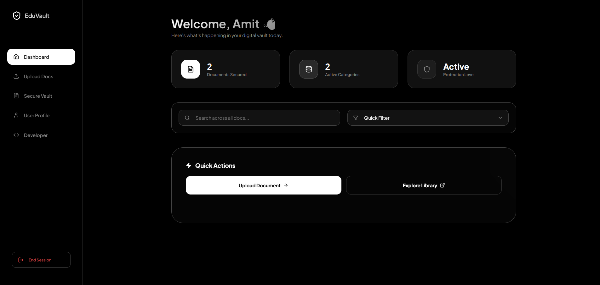
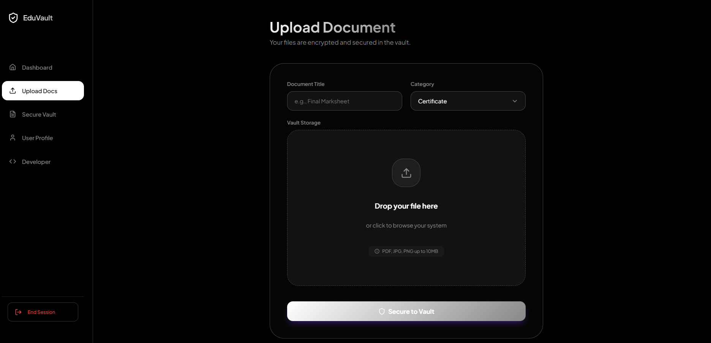

# EduVault - Digital Document Locker

EduVault is a secure MERN stack application allowing users to store and manage personal documents like certificates, resumes, and IDs.

## 🚀 Features

- **User Authentication**: Secure Signup/Login with JWT.
- **Document Management**: Upload, View, Delete, and Categorize documents.
- **Secure Storage**: Files are stored securely (Server-side storage implemented).
- **Responsive UI**: Modern, glassmorphism-inspired design.
- **Filtering**: Search and filter documents by category.


## 📸 Screenshots

### Login Page


<br><br>

### Dashboard


<br><br>

### Upload


## 🛠️ Tech Stack

- **Frontend**: React (Vite), Vanilla CSS (Responsive)
- **Backend**: Node.js, Express.js
- **Database**: MongoDB (Mongoose)
- **Security**: bcryptjs, JWT, Protected Routes

## 📦 Setup Instructions

1.  **Clone the Repository**
    ```bash
    git clone <repo-url>
    cd EduVault
    ```

2.  **Backend Setup**
    ```bash
    cd backend
    npm install
    # Create .env file with PORT and MONGO_URI
    npm start
    ```

3.  **Frontend Setup**
    ```bash
    cd frontend
    npm install
    npm run dev
    ```

## 📝 Usage

1.  Register a new account.
2.  Go to the **Upload** page to add a document (PDF, JPG, PNG).
3.  View all your files in **My Documents**.
4.  Use the **Dashboard** for a quick overview.
#


